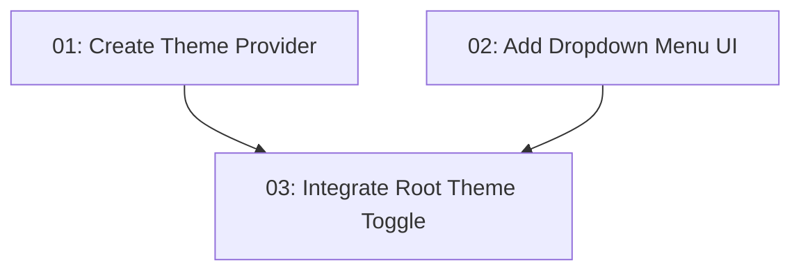

# Add Dark Mode

## Overview

Add first-class dark mode support to the TanStack Start app using the shadcn/ui TanStack Start dark mode pattern. The implementation will persist the selected theme in `localStorage`, support `light`, `dark`, and `system` modes, avoid hydration mismatch/FOUC with `ScriptOnce`, and replace the existing static theme button in the root shell with an accessible dropdown mode toggle.

## Quick Links

- [Requirements](./requirements.md) — full requirements and acceptance criteria
- [Action Required](./action-required.md) — manual steps needing human action

## Dependency Graph

## Waves

| Wave | Tasks | Description |
|------|-------|-------------|
| 1 | task-01, task-02 | Add independent building blocks: app theme provider and shared dropdown-menu UI component. |
| 2 | task-03 | Wire the provider into the TanStack Start root shell and replace the static theme button with a functional dropdown toggle. |

## Task Status

### Wave 1
- [x] [task-01-create-theme-provider](./tasks/task-01-create-theme-provider.md) — Create the TanStack Start theme provider
- [x] [task-02-add-dropdown-menu-ui](./tasks/task-02-add-dropdown-menu-ui.md) — Add shared shadcn dropdown-menu primitives

### Wave 2
- [ ] [task-03-integrate-root-theme-toggle](./tasks/task-03-integrate-root-theme-toggle.md) — Integrate provider and functional mode toggle in the root shell
