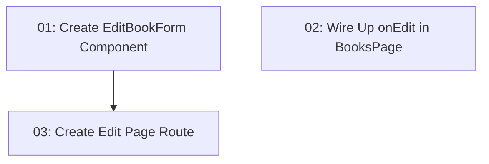

# Edit Book

## Overview

Adds an edit book flow to the library management UI. Users can click "Edit" on a book row in the books table, which navigates to a pre-populated edit form where they can modify book details. On save, a mock submission simulates the update and redirects back to the book list. This is frontend-only — all data remains in the static mock `BOOKS` array (no database persistence).

## Quick Links

- [Requirements](./requirements.md) — full requirements and acceptance criteria
- [Action Required](./action-required.md) — manual steps needing human action

## Dependency Graph

## Waves

| Wave | Tasks | Description |
|------|-------|-------------|
| 1 | task-01, task-02 | Create the edit form component and wire the "Edit" action in the books table — these can run in parallel |
| 2 | task-03 | Create the edit page route that composes the form component into a navigable page |

## Task Status

### Wave 1
- [x] [task-01-edit-book-form](./tasks/task-01-edit-book-form.md) — Create EditBookForm component
- [x] [task-02-wire-up-onedit](./tasks/task-02-wire-up-onedit.md) — Wire up onEdit callback in BooksPage

### Wave 2
- [x] [task-03-edit-page-route](./tasks/task-03-edit-page-route.md) — Create the /books/$id/edit route
