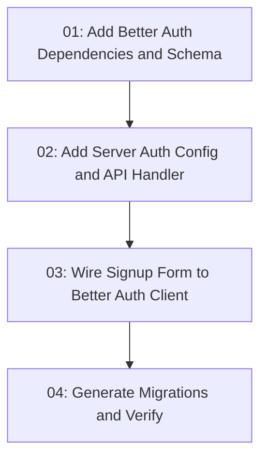

# Email Password Auth

## Overview

Implement real email/password registration with Better Auth in the TanStack app, backed by the existing Drizzle/PostgreSQL database package. The current signup page only validates locally and simulates loading; this feature adds the Better Auth schema, server configuration, auth route handler, client integration, and migration/verification workflow required for a working signup flow.

## Quick Links

- [Requirements](./requirements.md) — full requirements and acceptance criteria
- [Action Required](./action-required.md) — manual steps needing human action

## Dependency Graph

## Waves

| Wave | Tasks | Description |
|------|-------|-------------|
| 1 | task-01 | Add Better Auth packages and Drizzle schema foundation |
| 2 | task-02 | Configure Better Auth server and expose the auth API handler |
| 3 | task-03 | Connect the existing signup UI to `authClient.signUp.email` |
| 4 | task-04 | Generate database migrations, add migrate script, and run verification |

## Task Status

### Wave 1
- [x] [task-01-auth-dependencies-and-schema](./tasks/task-01-auth-dependencies-and-schema.md) — Add Better Auth dependencies and database schema

### Wave 2
- [x] [task-02-server-auth-config-and-handler](./tasks/task-02-server-auth-config-and-handler.md) — Add Better Auth server config and API route handler

### Wave 3
- [x] [task-03-client-signup-integration](./tasks/task-03-client-signup-integration.md) — Wire signup form to Better Auth client

### Wave 4
- [ ] [task-04-migrations-and-verification](./tasks/task-04-migrations-and-verification.md) — Generate migrations and verify the feature
