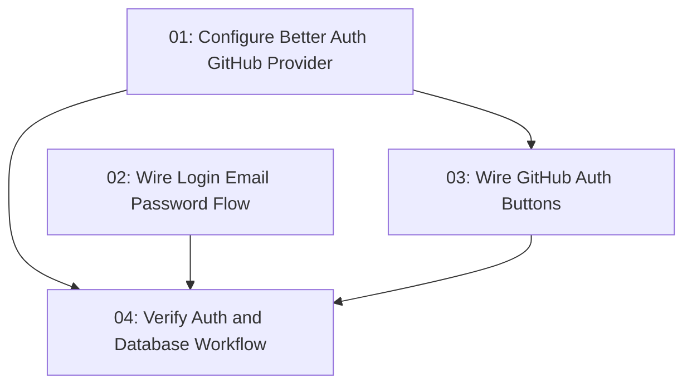

# Email Password GitHub Auth

## Overview

Complete the app's Better Auth implementation by supporting real email/password login and GitHub OAuth in addition to the existing email/password signup foundation. The work configures the GitHub social provider on the Better Auth server, wires the existing login page to `authClient.signIn.email`, adds GitHub sign-in behavior to login and signup pages, and verifies the Drizzle/Better Auth setup without using `drizzle push`.

## Quick Links

- [Requirements](./requirements.md) — full requirements and acceptance criteria
- [Action Required](./action-required.md) — manual steps needing human action

## Dependency Graph

## Waves

| Wave | Tasks | Description |
|------|-------|-------------|
| 1 | task-01, task-02 | Configure server-side GitHub OAuth and implement email/password login in parallel |
| 2 | task-03 | Connect existing GitHub buttons to Better Auth social sign-in |
| 3 | task-04 | Run migration checks, lint, typecheck, build, and auth-focused review |

## Task Status

### Wave 1

- [x] [task-01-server-github-provider](./tasks/task-01-server-github-provider.md) — Configure Better Auth GitHub provider
- [x] [task-02-login-email-password](./tasks/task-02-login-email-password.md) — Wire login form to Better Auth email/password sign-in

### Wave 2

- [ ] [task-03-github-auth-ui](./tasks/task-03-github-auth-ui.md) — Wire login and signup GitHub buttons to Better Auth social sign-in

### Wave 3

- [ ] [task-04-verify-auth-and-migrations](./tasks/task-04-verify-auth-and-migrations.md) — Verify migrations, quality checks, and Better Auth implementation
