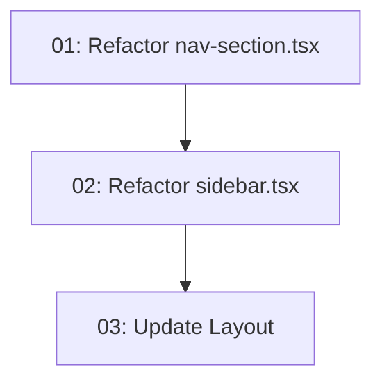

# Refactor Sidebar to shadcn/ui

## Overview

Refactors the current custom-built sidebar in `apps/tanstack-app` to use the already-installed shadcn/ui sidebar components from `packages/ui`. The shadcn sidebar provides built-in state management (SidebarProvider), collapsible icon mode, keyboard shortcuts, and mobile support out of the box.

The key requirement: **preserve the exact visual style** — the sidebar must look identical to the current implementation after the refactor. This means overriding shadcn sidebar defaults with custom Tailwind classes to match the existing design: `bg-card` background, `bg-primary` active nav items, muted toggle button, 72px header with brand icon, and the Bookary logo.

## Quick Links

- [Requirements](./requirements.md) — full requirements and acceptance criteria
- [Action Required](./action-required.md) — manual steps needing human action

## Dependency Graph

## Waves

| Wave | Tasks | Description |
|------|-------|-------------|
| 1 | task-01 | Refactor `nav-section.tsx` to use shadcn sidebar menu primitives (SidebarMenuButton, etc.) while preserving active/hover styling |
| 2 | task-02 | Create `AppSidebar` component that composes shadcn sidebar layout primitives with custom styling |
| 3 | task-03 | Update `_authenticated/route.tsx` layout to wrap with SidebarProvider and use AppSidebar |

## Task Status

### Wave 1
- [x] [task-01-nav-section](./tasks/task-01-nav-section.md) — Refactor nav-section.tsx

### Wave 2
- [x] [task-02-app-sidebar](./tasks/task-02-app-sidebar.md) — Refactor sidebar.tsx

### Wave 3
- [x] [task-03-update-layout](./tasks/task-03-update-layout.md) — Update authenticated layout
