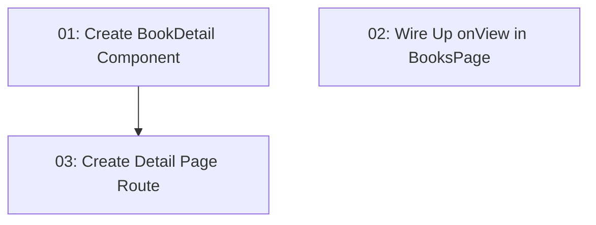

# View Detail Book

## Overview

Adds a book detail/view page to the library management UI. Users can click "View Details" on a book row in the books table, which navigates to a read-only detail page showing all book information in a visual card layout. From the detail page, users can navigate back to the list or jump to the edit form. This is frontend-only — all data remains in the static mock `BOOKS` array (no database persistence).

## Quick Links

- [Requirements](./requirements.md) — full requirements and acceptance criteria
- [Action Required](./action-required.md) — manual steps needing human action

## Dependency Graph

## Waves

| Wave | Tasks | Description |
|------|-------|-------------|
| 1 | task-01, task-02 | Create the BookDetail component and wire the "View Details" action in the books table — these can run in parallel |
| 2 | task-03 | Create the detail page route that composes the BookDetail component into a navigable page |

## Task Status

### Wave 1
- [x] [task-01-book-detail-component](./tasks/task-01-book-detail-component.md) — Create BookDetail component
- [x] [task-02-wire-up-onview](./tasks/task-02-wire-up-onview.md) — Wire up onView callback in BooksPage

### Wave 2
- [ ] [task-03-detail-page-route](./tasks/task-03-detail-page-route.md) — Create the /books/$id route
