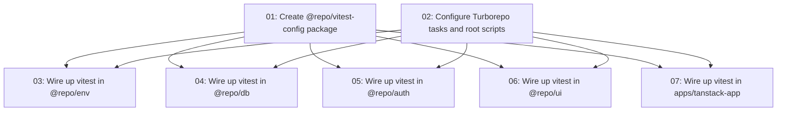

# Vitest Testing Setup

## Overview

Triển khai testing sử dụng Vitest trên toàn bộ turborepo monorepo. Tạo một shared config package (`@repo/vitest-config`) cung cấp các preset config cho node environment và react/jsdom environment, sau đó tích hợp vitest vào tất cả các package và app hiện có. Package vitest-config được thiết kế để tái sử dụng: bất kỳ package hoặc app mới nào trong tương lai chỉ cần extends từ preset phù hợp.

## Quick Links

- [Requirements](./requirements.md) — full requirements and acceptance criteria
- [Action Required](./action-required.md) — manual steps needing human action

## Dependency Graph

## Waves

| Wave | Tasks | Description |
|------|-------|-------------|
| 1 | task-01, task-02 | Tạo shared vitest config package và cấu hình Turborepo (2 tasks, chạy song song) |
| 2 | task-03, task-04, task-05, task-06, task-07 | Tích hợp vitest vào từng package/app riêng lẻ (5 tasks, chạy song song) |

## Task Status

### Wave 1
- [x] [task-01-create-vitest-config-package](./tasks/task-01-create-vitest-config-package.md) — Tạo `@repo/vitest-config` package với các preset config
- [x] [task-02-configure-turborepo-tasks](./tasks/task-02-configure-turborepo-tasks.md) — Thêm task `test` và `test:watch` vào turbo.json

### Wave 2
- [ ] [task-03-wire-up-package-env](./tasks/task-03-wire-up-package-env.md) — Tích hợp vitest vào `@repo/env`
- [ ] [task-04-wire-up-package-db](./tasks/task-04-wire-up-package-db.md) — Tích hợp vitest vào `@repo/db`
- [ ] [task-05-wire-up-package-auth](./tasks/task-05-wire-up-package-auth.md) — Tích hợp vitest vào `@repo/auth`
- [ ] [task-06-wire-up-package-ui](./tasks/task-06-wire-up-package-ui.md) — Tích hợp vitest vào `@repo/ui`
- [ ] [task-07-wire-up-app-tanstack](./tasks/task-07-wire-up-app-tanstack.md) — Tích hợp vitest vào `apps/tanstack-app`
